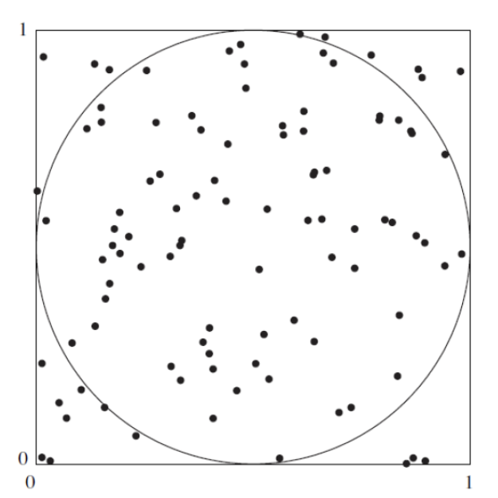

```{r setup, include=FALSE}
knitr::opts_chunk$set(echo = TRUE)
```
  
  <h1>Estimación del valor de π </h1>
  
  
<p> La siguiente figura sugiere como estimar el valor de π con una simulación. En la figura, un circuito con un área igual a π/4, está inscrito en un cuadrado cuya área es igual a 1. Se elige de forma aleatoria n puntos dentro del cuadrado . La probabilidad de que un punto esté dentro del círculo es igual a la fracción del área del cuadrado que abarca a este, la cual es π/4. Por tanto, se puede estimar el valor de π/4 al contar el número de puntos dentro del círculo, para obtener la estimación de π/4. De este último resultado se encontrar una aproximación para el valor de π.
</p>




<h2>Simulación</h2>

```{r }
# Definir la cantidad de puntos a generar
n <- 10000

# Inicializar contador para contar puntos dentro del círculo
count_inside_circle <- 0

# Crear un gráfico vacío para visualizar la simulación
plot(1, type = "n", xlim = c(0, 1), ylim = c(0, 1), xlab = "", ylab = "", main = "Simulación de Estimación de Pi")

# Dibujar el círculo
theta <- seq(0, 2 * pi, length.out = 100)
x_circle <- 0.5 + 0.5 * cos(theta)
y_circle <- 0.5 + 0.5 * sin(theta)
lines(x_circle, y_circle, col = "blue")

# Iterar para generar n coordenadas x e y y determinar si están dentro del círculo
for (i in 1:n) {
  
  # Generar coordenada x de forma aleatoria (distribución uniforme en el intervalo [0, 1])
  Xi <- runif(1, 0, 1)
  
  # Generar coordenada y de forma aleatoria (distribución uniforme en el intervalo [0, 1])
  Yi <- runif(1, 0, 1)
  
  # Calcular el cuadrado de la distancia desde el centro
  distancia_cuadrada <- (Xi - 0.5)^2 + (Yi - 0.5)^2

  # Comprobar si el punto está dentro del círculo (distancia < 0.25)
  if (distancia_cuadrada < 0.25) {
    count_inside_circle <- count_inside_circle + 1
    points(Xi, Yi, col = "green", pch = 19)
  } else {
    points(Xi, Yi, col = "red", pch = 19)
  }
}

# Calcular la estimación de π/4
estimacion_pi <- count_inside_circle / n

# Calcular el valor estimado de π
valor_estimado_pi <- estimacion_pi * 4

```

<h2>Generación de puntos adicionales</h2>
<h3>Puntos adicionales para 10,000</h3>
```{r }
# Definir la cantidad de puntos a generar (10,000 puntos)
n <- 10000

# Inicializar contador para contar puntos dentro del círculo para la simulación con 10,000 puntos
count_inside_circle <- 0

# Crear un gráfico vacío
plot(0, 0, xlim = c(0, 1), ylim = c(0, 1), xlab = "", ylab = "", main = "Simulación de Montecarlo para π")

# Dibujar el círculo
lines(x_circle, y_circle, col = "blue")

# Iterar para generar n coordenadas x e y y determinar si están dentro del círculo
for (i in 1:n) {
  
  # Generar coordenada x de forma aleatoria (distribución uniforme en el intervalo [0, 1])
  Xi <- runif(1, 0, 1)
  
  # Generar coordenada y de forma aleatoria (distribución uniforme en el intervalo [0, 1])
  Yi <- runif(1, 0, 1)
  
  # Calcular el cuadrado de la distancia desde el centro
  distancia_cuadrada <- (Xi - 0.5)^2 + (Yi - 0.5)^2
  
  # Comprobar si el punto está dentro del círculo (distancia < 0.25)
  if (distancia_cuadrada < 0.25) {
    count_inside_circle <- count_inside_circle + 1
    points(Xi, Yi, col = "green", pch = 19)
  } else {
    points(Xi, Yi, col = "red", pch = 19)
  }
}

# Calcular la estimación de π/4
estimacion_pi <- count_inside_circle / n

# Calcular el valor estimado de π
valor_estimado_pi <- estimacion_pi * 4

```

<h3>Puntos adicionales para 100.000</h3>
```{r }
# Definir la cantidad de puntos a generar (100,000 puntos)
n_100000 <- 100000

# Inicializar contador para contar puntos dentro del círculo para la simulación con 100,000 puntos
count_inside_circle_100000 <- 0

# Crear un gráfico vacío para la simulación con 100,000 puntos
plot(0, 0, xlim = c(0, 1), ylim = c(0, 1), xlab = "", ylab = "", main = "Simulación de Montecarlo para π (100,000 puntos)")

# Dibujar el círculo
lines(x_circle, y_circle, col = "blue")

# Iterar para generar n_100000 coordenadas x e y y determinar si están dentro del círculo
for (i in 1:n_100000) {
  
  # Generar coordenada x de forma aleatoria (distribución uniforme en el intervalo [0, 1])
  Xi <- runif(1, 0, 1)
  
  # Generar coordenada y de forma aleatoria (distribución uniforme en el intervalo [0, 1])
  Yi <- runif(1, 0, 1)
  
  # Calcular el cuadrado de la distancia desde el centro
  distancia_cuadrada <- (Xi - 0.5)^2 + (Yi - 0.5)^2
  
  # Comprobar si el punto está dentro del círculo (distancia < 0.25)
  if (distancia_cuadrada < 0.25) {
    count_inside_circle_100000 <- count_inside_circle_100000 + 1
    points(Xi, Yi, col = "green", pch = 19)
  } else {
    points(Xi, Yi, col = "red", pch = 19)
  }
}

# Calcular la estimación de π/4 para 100,000 puntos
estimacion_pi_100000 <- count_inside_circle_100000 / n_100000

# Calcular el valor estimado de π para 100,000 puntos
valor_estimado_pi_100000 <- estimacion_pi_100000 * 4

```
<h2>Validación</h2>
```{r }
# Imprimir los resultados en el informe para 10,000 puntos
cat("Estimación de π con 10,000 puntos:", valor_estimado_pi, "\n")

# Imprimir los resultados en el informe para 100,000 puntos
cat("Número de puntos dentro del círculo (100,000 puntos):", count_inside_circle_100000, "\n")
cat("Estimación de π con 100,000 puntos:", valor_estimado_pi_100000, "\n")
```